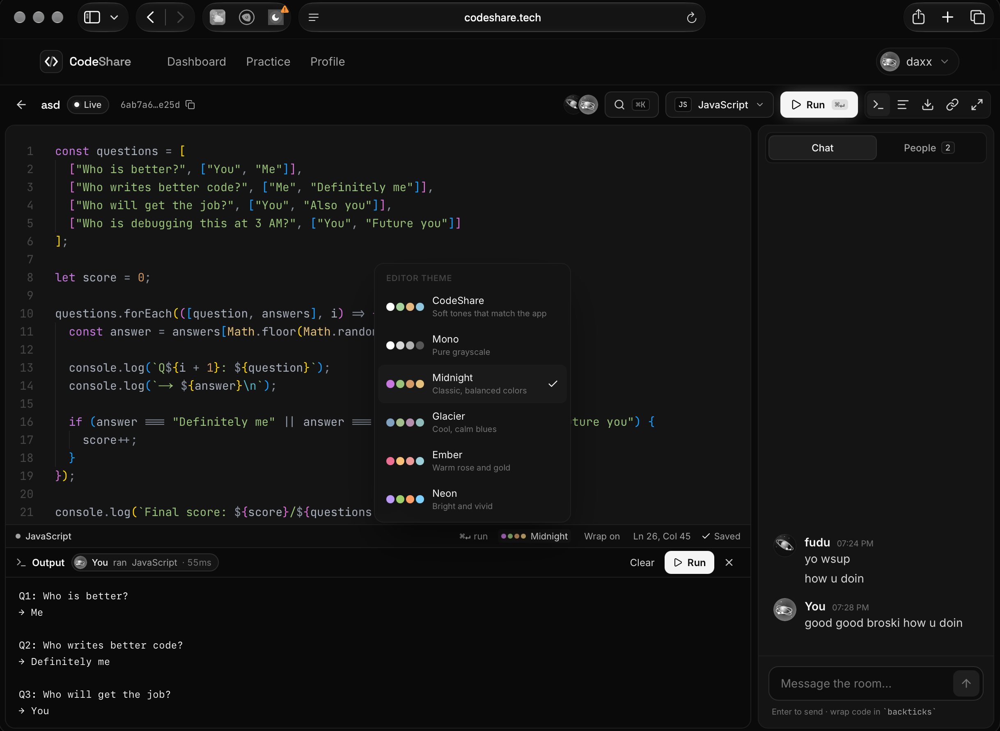

# CodeShare

Real-time collaborative coding rooms — create a room, share the link, and edit code with your team live.

     

---

## Overview

CodeShare is a real-time collaborative coding platform. Users create a room, invite others with a shareable link, and edit code together with live syntax highlighting, an in-room chat, and presence indicators showing who's currently online — no setup required on either end.

This is a portfolio project built incrementally, one feature at a time, with an emphasis on clean architecture and decisions I can explain in an interview over sheer feature count.

## Project status

Actively in development. Auth and the full UI shell are working end-to-end against mock data; the real-time and persistence layers are the current focus.

| Area | Status |
|---|---|
| UI shell (landing, dashboard, room view) | ✅ Done — dark, responsive, developer-focused |
| Authentication (Clerk) | ✅ Done — sign-up/in, protected routes |
| Room CRUD + MongoDB persistence | 🚧 Not started (dashboard currently uses mock data) |
| Real-time sync (Socket.IO) | 🚧 Not started (editor/chat currently use local mock state) |
| Code editor (Monaco) | 🚧 Not started (room view currently renders static read-only code) |
| Deployment | 🚧 Not started |

## Features

- **Authentication** — email/password sign-up and sign-in via Clerk, with protected dashboard and room routes
- **Dashboard** — view your rooms, create a new one, delete rooms you own *(currently mock data — not yet backed by a database)*
- **Room view** — code panel, language selector, online-users sidebar, and live chat panel *(currently mock data — not yet backed by sockets)*
- **Responsive layout** — usable from a phone up through a full desktop width
- Planned: real-time collaborative editing, persisted chat and code, live presence, Monaco-based syntax highlighting for JavaScript, TypeScript, Python, C++, and Java

## Tech stack

**Frontend** — Next.js 16 (App Router), React, TypeScript, Tailwind CSS v4, Clerk
**Backend** — Node.js, Express, TypeScript, MongoDB + Mongoose
**Real-time** *(planned)* — Socket.IO
**Editor** *(planned)* — Monaco Editor

**Deployment targets** — Frontend on Vercel · Backend on Render/Railway · Database on MongoDB Atlas

## Architecture

Monorepo-style layout — two independent apps that run side by side in development:

```text
codeshare/
├── client/                      # Next.js app
│   ├── app/                     # routes: /, /dashboard, /room/[id], /sign-in, /sign-up
│   ├── components/              # Navbar, etc.
│   ├── lib/                     # api.ts (axios client)
│   ├── types/                   # Room, ChatMessage, OnlineUser
│   └── proxy.ts                 # Clerk middleware (Next.js 16 naming)
│
├── server/
│   ├── src/
│   │   ├── config/db.ts         # MongoDB connection, fail-fast on startup
│   │   ├── controllers/         # (planned)
│   │   ├── models/              # (planned)
│   │   ├── routes/              # (planned)
│   │   ├── sockets/             # (planned)
│   │   └── server.ts            # Express app entry point
│   └── ...
│
├── .gitignore
├── README.md
└── package.json                 # root — orchestrates `npm run dev`
```

**Request flow (once the API layer exists):**
```text
React (client) → HTTP request → Express route → Controller → Service → MongoDB
```

**Real-time flow (planned):**
```text
Client (Socket.IO) → server socket handler → room → broadcast event → other clients in that room
```

**Auth flow (implemented):** Clerk's `proxy.ts` middleware protects `/dashboard` and `/room/*`. Signed-out users are redirected to `/sign-in` before any page code runs — there's no separate client-side auth check to keep in sync with the server-side one.

## Screenshots

<!-- Add screenshots here before publishing, e.g.: -->
<!--  -->
<!--  -->

*(Screenshots coming soon.)*

## Local setup

**Prerequisites:** Node.js 20+, npm, a free [Clerk](https://dashboard.clerk.com) account, a free [MongoDB Atlas](https://www.mongodb.com/cloud/atlas/register) cluster.

```bash
git clone https://github.com/<your-username>/codeshare.git
cd codeshare

# Install dependencies for both apps + root orchestration
npm install --prefix client
npm install --prefix server
npm install
```

Create the environment files described below, then run both apps together:

```bash
npm run dev
```

- Frontend: [http://localhost:3000](http://localhost:3000)
- Backend: [http://localhost:5001](http://localhost:5001)

> Port 5000 is intentionally avoided — it conflicts with macOS's AirPlay Receiver.

## Environment variables

**`client/.env.local`**
```env
NEXT_PUBLIC_API_URL=http://localhost:5001

NEXT_PUBLIC_CLERK_PUBLISHABLE_KEY=
CLERK_SECRET_KEY=
NEXT_PUBLIC_CLERK_SIGN_IN_URL=/sign-in
NEXT_PUBLIC_CLERK_SIGN_UP_URL=/sign-up
NEXT_PUBLIC_CLERK_SIGN_IN_FALLBACK_REDIRECT_URL=/dashboard
NEXT_PUBLIC_CLERK_SIGN_UP_FALLBACK_REDIRECT_URL=/dashboard
```
Get your publishable/secret keys from the **API keys** page of your Clerk application dashboard.

**`server/.env`**
```env
PORT=5001
CLIENT_URL=http://localhost:3000
NODE_ENV=development
MONGODB_URI=
```
Get your connection string from MongoDB Atlas (Database → Connect → Drivers). Note: there's no `JWT_SECRET` here — the original plan was custom JWT auth, but the project pivoted to Clerk, which handles auth entirely on the frontend. A `CLERK_SECRET_KEY` will be added here once the backend needs to verify Clerk sessions on protected API routes.

## API overview

The backend currently exposes a single endpoint, used to confirm the frontend/backend/database chain is alive:

| Method | Route | Description |
|---|---|---|
| `GET` | `/` | Health check — confirms the server is running and MongoDB is connected |

A full REST API for rooms and messages is planned (see Roadmap).

## WebSocket / event overview (planned)

No sockets are wired up yet — the room view currently runs entirely on local mock state. The intended event design:

| Event | Direction | Purpose |
|---|---|---|
| `room:join` | client → server | Join a room's Socket.IO channel |
| `room:leave` | client → server | Leave a room's channel |
| `presence:update` | server → clients | Broadcast current online users in a room |
| `code:change` | client ↔ server | Sync code edits across connected clients |
| `chat:message` | client ↔ server | Send/receive chat messages in a room |

## Deployment (planned)

- **Frontend** → Vercel
- **Backend** → Render or Railway
- **Database** → MongoDB Atlas (already used in local dev, so no migration needed)

Deployment steps will be documented here once the app is feature-complete enough to ship.

## Roadmap

- [ ] Room and message Mongoose models
- [ ] Room CRUD API (create, join, leave, delete)
- [ ] Socket.IO real-time code sync and chat
- [ ] Live online-presence indicators
- [ ] Monaco Editor integration with language-aware syntax highlighting
- [ ] Code persistence — restore latest saved code on reconnect
- [ ] Tests for auth, room creation, and room authorization
- [ ] Deployment to Vercel / Render / Atlas
- [ ] Stretch: file explorer, multiple files per room, cursor sync, code execution
