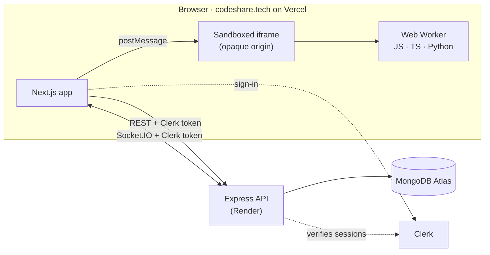

<div align="center">

# CodeShare

**Real-time collaborative coding rooms. Create a room, share the link, and write, run and test code together, right in the browser.**

[](https://codeshare.tech)


**[Try it live →](https://codeshare.tech)** · [Features](#features) · [How it works](#how-it-works) · [Run it locally](#run-it-locally) · [API](#api-reference) · [Roadmap](#roadmap)

</div>

---

## Overview

CodeShare is a real-time collaborative coding platform. Everyone in a room edits the same file live, with named cursors, presence and a built-in chat. Code runs right in the browser in a locked-down sandbox (JavaScript, TypeScript and Python), and a built-in **Practice** library turns any room into a place to solve interview problems together against real test cases.

I built it one feature at a time as a portfolio project, favouring decisions I can explain over sheer feature count.

### Try it in a minute

1. Open **[codeshare.tech](https://codeshare.tech)** and sign up with your email.
2. Create a room, then open its link in a second browser window. Type in one and watch it appear in the other.
3. Press <kbd>⌘</kbd> <kbd>↵</kbd> (<kbd>Ctrl</kbd> <kbd>Enter</kbd> on Windows) to run the code. Everyone in the room sees the output.
4. Open **Practice**, pick a problem, and click **Run tests**.

## Features

### Collaborate in real time
- **Shared editor.** Monaco (the editor behind VS Code) with live sync, named remote cursors, and syntax highlighting for JavaScript, TypeScript, Python, C++ and Java.
- **Live presence.** See who's in the room, with join and leave notices.
- **Shared runs.** Language changes and run results are broadcast to everyone, labelled with who ran the code.
- **One link to join.** No invites, no setup on the other person's side.

### Run code in the browser
- **Three languages.** JavaScript, TypeScript and Python (3.14, via Pyodide) run client-side in an isolated sandbox, with no server cost and no access to the app.
- **Runaway code is stopped.** Infinite loops are ended after 5 s (JavaScript/TypeScript) or 10 s (Python), and the next run works immediately.
- **Clear output.** Errors come with line numbers, `console.log` and `print` output is captured, and output is capped at 20,000 characters.

### Practice interview problems together
- **56 problems** (17 Easy · 28 Medium · 11 Hard) across 22 topics, including arrays, graphs, trees, linked lists, dynamic programming and backtracking, with **357 test cases**.
- **Solve in a room.** Pick a problem and a language, and CodeShare opens a room with starter code and a Problem tab.
- **Run tests.** Your solution is checked against every test case in the sandbox, with expected vs. actual output for each one, shared with the room.
- **Correct judging.** Linked lists and binary trees are real `ListNode` / `TreeNode` objects. In-place problems and "any order" answers are judged correctly.
- **Progress tracking.** Solved problems, per-difficulty progress, filters by topic, difficulty and status, and "continue where you left off". Practice rooms stay off your dashboard.

### Chat in every room
- **Persistent chat** with message grouping, avatars, a typing indicator, emoji reactions and an unread badge.
- **Share code in chat.** Right-click selected code to send it to chat, rendered as a code block.

### Dashboard and profiles
- **Dashboard.** Create, search, sort, filter by language and delete rooms. Join any room by pasting its link, and see rooms you recently joined.
- **Profiles.** A 3-step onboarding (username, avatar, bio) and a profile page with your favourite language, GitHub handle and stats.

### Polish
- **Keyboard-first.** <kbd>⌘</kbd> <kbd>K</kbd> command palette, <kbd>⌘</kbd> <kbd>↵</kbd> to run, <kbd>N</kbd> for a new room, <kbd>/</kbd> to search, <kbd>?</kbd> for every shortcut.
- **Editor comfort.** 6 editor themes, word wrap, font-size controls, one-click formatting with Prettier, download and copy, a resizable sidebar and focus mode.
- **Works everywhere.** Responsive down to phones (tabbed room layout), with visible focus rings, a skip-to-content link and full `prefers-reduced-motion` support.
- **Finishing touches.** Page transitions, a navigation progress bar, and a branded link-preview card when you share a URL.

## How it works



### Real-time sync
- **Rooms and presence.** Each room is a Socket.IO room. The server keeps an in-memory presence map and broadcasts `presence:update` whenever someone joins or leaves.
- **Saving edits.** Edits are broadcast instantly, then saved to MongoDB after 1.5 s of quiet. Pending saves are flushed right away when the last person leaves, and on shutdown (`SIGINT`/`SIGTERM`), so an edit is never silently lost.
- **Authenticated sockets.** Connections authenticate in the handshake with the same Clerk token as the REST API. Every event payload is validated, and room events are only accepted from sockets that actually joined that room.

### Sandboxed code execution
- **Isolation.** Code runs in a hidden iframe with `sandbox="allow-scripts"` and **no** `allow-same-origin`. That gives it an opaque origin, so it can't read the app's cookies, storage, session or page.
- **Hard time limits.** Inside the frame, code runs in a Web Worker. Limits are enforced from outside: if a run doesn't finish in time, the iframe is removed, which kills the worker. `while (true) {}` can never freeze the tab.
- **JavaScript and TypeScript.** JavaScript gets a fresh sandbox for every run. TypeScript's type annotations are stripped in the browser with Babel first.
- **Python.** Python runs on **Pyodide 314**, CPython 3.14 compiled to WebAssembly. It's downloaded on first use and kept warm between runs.
- **A subtle bug.** Pyodide only runs in *module* workers, and Chrome won't start a module worker from a `blob:` URL inside an opaque-origin frame. The Python worker is therefore started from a `data:` URL, which also gets its own separate origin.
- **Fallback.** If a browser can't create workers, the runner falls back to running inside the sandboxed frame itself.

### The Practice judge
- **Problems are data.** Each one declares typed parameters (like `int[]`, `list` or `tree`), a return type and test cases. Starter code for all three languages is generated from those types, including `ListNode` / `TreeNode` classes where needed.
- **Answers stay outside the sandbox.** Only the inputs go in. The judge compares results outside, with exact and order-insensitive modes (for example, "return all permutations in any order").
- **Lists and trees.** They travel as arrays (LeetCode style), are rebuilt into real nodes inside the sandbox, and are read back afterwards. Cycle detection turns a broken list into a clear error instead of a hang.
- **Verified test data.** Every test case was checked against two independent reference solutions, one in JavaScript and one in Python.
- **Atomic progress.** Solving a problem is recorded with a single atomic MongoDB update, so a double submit can never count twice.

### Auth and security
- **Route protection.** Clerk handles sign-up and sign-in. `proxy.ts` (Next.js 16 middleware) protects `/dashboard`, `/room`, `/profile` and `/onboarding` before any page code runs.
- **The backend never trusts the frontend.** Every API route re-verifies the Clerk session from the `Authorization: Bearer` header. The app and API live on different origins, so auth uses tokens, not cookies.
- **Server-side rules.** Owner-only actions (rename, delete) are enforced on the server. Inputs are validated: room names, code size, usernames, problem slugs and language allowlists.
- **Locked-down API.** CORS only accepts an allowlist of site origins, and Helmet sets security headers.

### Keeping a free deployment fast
- **No cold starts.** The API runs on Render's free tier, which sleeps after 15 idle minutes and takes about a minute to wake. An uptime monitor pings it every 5 minutes, so visitors don't hit a cold start.
- **Faster sign-up.** New sign-ups go straight to onboarding instead of bouncing through the dashboard, which saves a round trip to the server.

## Tech stack

| Layer | Technologies |
|---|---|
| Frontend | Next.js 16 (App Router), React 19, TypeScript, Tailwind CSS v4, Framer Motion, Lenis, Lucide |
| Editor | Monaco Editor, Prettier |
| Code execution | Sandboxed iframes, Web Workers, Babel (TypeScript), Pyodide (Python) |
| Real-time | Socket.IO |
| Backend | Node.js, Express 5, TypeScript |
| Database | MongoDB Atlas, Mongoose |
| Auth | Clerk |
| Hosting | Vercel (frontend), Render (API), MongoDB Atlas (database), UptimeRobot (keep-alive) |

## Project structure

```text
codeshare/
├── client/                        # Next.js 16 app → Vercel
│   ├── app/
│   │   ├── page.tsx               # landing page
│   │   ├── dashboard/             # your rooms, recently joined, create and join
│   │   ├── room/[id]/             # the collaborative room
│   │   ├── practice/              # problem library and problem pages
│   │   ├── onboarding/            # 3-step profile setup
│   │   ├── profile/               # profile and stats
│   │   ├── sign-in/, sign-up/     # Clerk
│   │   ├── template.tsx           # page transitions
│   │   └── opengraph-image.tsx    # link-preview card
│   ├── components/                # CodeEditor, ChatPanel, RunPanel, ProblemPanel,
│   │                              #   CommandPalette, PresenceStack, landing/, …
│   ├── lib/
│   │   ├── execution.ts           # sandbox lifecycle, time limits, test reports
│   │   ├── sandboxRunners.ts      # code that runs inside the sandbox
│   │   ├── judge.ts               # compares results (exact or order-insensitive)
│   │   ├── problems.ts            # practice problems and starter-code generator
│   │   ├── socket.ts              # Socket.IO client
│   │   └── api.ts                 # authenticated REST client
│   ├── types/
│   └── proxy.ts                   # Clerk route protection (Next.js 16 middleware)
├── server/                        # Express API + Socket.IO → Render
│   └── src/
│       ├── server.ts              # app setup, CORS, Clerk, routes, graceful shutdown
│       ├── routes/                # rooms, profile
│       ├── controllers/           # rooms, profiles, messages
│       ├── models/                # Room, Message, Profile
│       ├── sockets/               # presence, chat, reactions, cursors, code sync, shared runs
│       ├── middleware/            # requireAuth, errorHandler
│       └── config/db.ts           # MongoDB connection
└── package.json                   # `npm run dev` starts both apps
```

## API reference

Every route except the health check requires a signed-in user (`Authorization: Bearer <Clerk token>`).

**Rooms**

| Method | Route | Description |
|---|---|---|
| `GET` | `/` | Health check |
| `POST` | `/api/rooms` | Create a room (optionally with starter code and a practice problem) |
| `GET` | `/api/rooms` | Your rooms (practice rooms excluded) |
| `GET` | `/api/rooms?problem=<slug>` | Your rooms for one practice problem |
| `GET` | `/api/rooms/:id` | A room by ID (anyone signed in can open a shared link) |
| `PATCH` | `/api/rooms/:id` | Rename a room (owner only) |
| `DELETE` | `/api/rooms/:id` | Delete a room (owner only) |
| `GET` | `/api/rooms/:id/messages` | A room's chat history |

**Profiles**

| Method | Route | Description |
|---|---|---|
| `GET` | `/api/profile` | Your profile (created on first visit) |
| `PUT` | `/api/profile` | Update username, avatar, bio, favourite language or GitHub handle |
| `GET` | `/api/profile/username-available?username=` | Check if a username is free |
| `GET` | `/api/profile/recent-rooms` | Rooms you recently joined |
| `POST` | `/api/profile/solved` | Record a solved practice problem |

**Socket events**

Sockets authenticate at handshake time with the same Clerk token, verified with `@clerk/backend`.

| Event | Direction | Purpose |
|---|---|---|
| `room:join` / `room:leave` | client → server | Join or leave a room |
| `presence:update` | server → room | Who's currently in the room |
| `code:change` | client ↔ room | Live edits (with cursor); debounce-saved to MongoDB |
| `cursor:move` | client ↔ room | Cursor positions |
| `language:change` → `language:update` | client → room | Switch the room's language |
| `chat:message` | client ↔ room | Send and receive chat (persisted) |
| `reaction:toggle` → `reaction:update` | client → room | Emoji reactions |
| `typing` | client → room | Typing indicator |
| `run:start` / `run:result` | client → room | Share code runs and test results |

## Run it locally

**You'll need:** Node.js 20+, npm, a free [Clerk](https://dashboard.clerk.com) application, and a free [MongoDB Atlas](https://www.mongodb.com/cloud/atlas/register) cluster.

```bash
git clone https://github.com/GitDaksh/codeshare.git
cd codeshare

npm install                  # root: runs both apps together
npm install --prefix client
npm install --prefix server
```

Create the two environment files below, then start everything:

```bash
npm run dev
```

- App: [http://localhost:3000](http://localhost:3000)
- API: [http://localhost:5001](http://localhost:5001)

> Port 5000 is avoided on purpose: macOS uses it for AirPlay Receiver.

**`client/.env.local`**
```env
NEXT_PUBLIC_API_URL=http://localhost:5001

NEXT_PUBLIC_CLERK_PUBLISHABLE_KEY=pk_test_...
CLERK_SECRET_KEY=sk_test_...
NEXT_PUBLIC_CLERK_SIGN_IN_URL=/sign-in
NEXT_PUBLIC_CLERK_SIGN_UP_URL=/sign-up
NEXT_PUBLIC_CLERK_SIGN_IN_FALLBACK_REDIRECT_URL=/dashboard
NEXT_PUBLIC_CLERK_SIGN_UP_FALLBACK_REDIRECT_URL=/onboarding
```

**`server/.env`**
```env
PORT=5001
CLIENT_URL=http://localhost:3000
MONGODB_URI=mongodb+srv://...
CLERK_PUBLISHABLE_KEY=pk_test_...
CLERK_SECRET_KEY=sk_test_...
```

- Use Clerk **development** keys (`pk_test_` / `sk_test_`) locally. Production keys only work on the production domain.
- Both files must use keys from the **same** Clerk application. Mismatched keys fail as silent 401s.
- `CLIENT_URL` accepts several comma-separated origins, for example a custom domain and its `www` version.

## Deployment

| Part | Where | Notes |
|---|---|---|
| Frontend | Vercel, on [codeshare.tech](https://codeshare.tech) | Production uses Clerk's live keys |
| API + sockets | Render (free tier) | Kept awake by an uptime monitor |
| Database | MongoDB Atlas (M0) | Separate databases for production and development |
| Auth | Clerk production instance | Domain verified on codeshare.tech |

## Design

A deliberately monochrome system: near-black surfaces, white and greys, with a single reserved red for real errors and disconnected states. Space Grotesk carries headlines, Inter the interface, and JetBrains Mono the code. Motion is used sparingly and always respects reduced-motion settings.

## Known limitations

- **Whole-document sync.** Each edit sends the full file, so if two people type at the exact same moment, one edit can overwrite the other. Moving to a CRDT (Yjs) is next on the roadmap.
- **C++ and Java can be edited but not run.** Running them needs a server-side sandbox, which doesn't fit a zero-cost deployment.
- **No automated test suite in the repo yet.** It's the next item on the roadmap.

## Roadmap

- [x] Real-time rooms: editor sync, presence, remote cursors, chat
- [x] In-browser code execution (JavaScript, TypeScript, Python) in a sandbox
- [x] Practice library with in-room tests and progress tracking
- [x] Custom domain and Clerk production instance
- [ ] Automated tests and CI on every pull request
- [ ] Conflict-free editing with Yjs, plus live selections and follow mode
- [ ] Interview mode: timer, interviewer notes, room permissions
- [ ] Google and GitHub sign-in in production

## Author

Built by **Daksh**: [@GitDaksh](https://github.com/GitDaksh)
